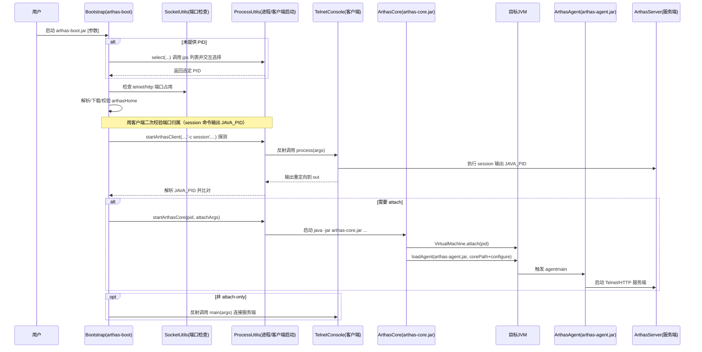

# Arthas Attach  流程解析

## 背景

Arthas 通过 JDK Attach API 动态连接到线上目标 JVM，并在目标进程内加载 agent，启动 Telnet/HTTP 服务端，实现在线诊断。理解其关键链路，能帮助我们在本地最小化复现"attach 成功并读取目标 JVM 信息"的核心流程。
> **安全注意**：Attach操作需要与目标JVM相同的操作系统权限，生产环境应严格控制attach权限
<!-- more -->
## 整体流程（中文时序图）



**一句话要点**：attach 建立连接、loadAgent 触发 agentmain，agentmain 启动服务端；Telnet 客户端再连接交互。

## 关键阶段简述

### 1. 端口归属校验阶段
- **目的**：确保目标 telnet 端口确实属于指定 PID，避免连接到错误进程
- **实现**：通过反射调用 `TelnetConsole.process(['-c', 'session', ...])` 执行 session 命令
- **输出**：session 命令会返回当前连接的 JVM 的 PID，用于与目标 PID 比对

### 2. Attach 注入阶段
- **VirtualMachine.attach(pid)**：与目标 JVM 建立"附加连接"（控制通道）
- **VirtualMachine.loadAgent(agentJarPath,options)**：在目标 JVM 内加载 agent，触发 agentmain(...) 执行
- **ArthasAgent/ArthasBootstrap**：在 agentmain 内启动 Telnet/HTTP 服务端，随后客户端连接进行诊断

### 3. 客户端连接阶段
- **非 attach-only 模式**：再次通过反射调用 `TelnetConsole.main(args)` 建立交互连接
- **attach-only 模式**：仅完成注入，不启动客户端

## 为什么使用反射调用 TelnetConsole

### 1. 版本隔离与动态加载
`arthas-client.jar` 随 `arthasHome` 版本变化，反射结合URLClassLoader使`boot`能动态加载对应版本，避免编译期绑定。

### 2. 避免类路径污染
`client` 的依赖（如 jline、commons-net）不混入 `arthas-boot` 的 classpath，降低冲突。

### 3. 同进程捕获状态与输出
反射调用`process(...)`可直接获取状态码并重定向输出，满足"探测端口/校验 PID/批处理"等非交互场景；相比启动外部进程更轻量。

### 4. TCCL 依赖加载
通过设置线程上下文类加载器（TCCL）确保 `TelnetConsole` 能加载其依赖（修复 issue 链路里提到的 TCCL 问题）。

## 最小复现 Demo
```xml
  <!-- 编译时依赖：JDK 8 需要 tools.jar -->
        <dependency>
            <groupId>com.sun</groupId>
            <artifactId>tools</artifactId>
            <version>1.8.0</version>
            <scope>system</scope>
            <systemPath>${java.home}/../lib/tools.jar</systemPath>
            <optional>true</optional>
        </dependency>
```

### 简单连接示例（读取目标 JVM 属性）

```java
import com.sun.tools.attach.VirtualMachine;
import com.sun.tools.attach.VirtualMachineDescriptor;
import java.util.List;
import java.util.Properties;
import java.util.jar.JarFile;

/**
 * 最小加载器：通过 Attach API 动态连接到目标 JVM，并加载最小 agent。
 * 用法：
 *   1) 列出本机 JVM：不传参运行，显示 PID 与主类名
 *   2) 加载 agent：java MinAttacher <PID> <agentPath> [agentArgs]
 */
public class MinAttacher {

    /**
     * 程序入口
     *
     * @param args 命令行参数：无参列出 JVM；或 <PID> <agentPath> [agentArgs]
     * @throws Exception 演示代码直接抛出异常
     */
    public static void main(String[] args) throws Exception {
        // 如果未传参：列出本机可附加的 JVM，帮助定位 PID
        if (args.length == 0) {
            // 调用 VirtualMachine.list() 获取本机可附加 JVM 列表
            List<VirtualMachineDescriptor> vms = VirtualMachine.list();
            // 打印列表：PID 与主类名/命令行
            System.out.println("可附加的 JVM 列表：");
            for (VirtualMachineDescriptor d : vms) {
                System.out.println("PID=" + d.id() + " MAIN=" + d.displayName());
            }
            // 打印用法提示
            System.out.println("用法：java MinAttacher <PID> <agentPath> [agentArgs]");
            // 返回结束
            return;
        }

        // 读取第一个参数：目标 JVM 的 PID
        String pid = args[0];


        // 先声明 VirtualMachine 句柄
        VirtualMachine vms = null;
        try {
            // 打印当前 JVM 架构信息，帮助诊断问题
            System.out.println("当前 JVM 架构信息:");
            System.out.println("  os.arch = " + System.getProperty("os.arch"));
            System.out.println("  sun.arch.data.model = " + System.getProperty("sun.arch.data.model"));
            System.out.println("  java.home = " + System.getProperty("java.home"));
            
            // 执行 attach：与目标 JVM 建立附加连接
            System.out.println("尝试附加到目标 JVM，PID=" + pid);
            vms = VirtualMachine.attach(pid);
            System.out.println("附加成功！");
            
            // 获取目标 JVM 的系统属性，验证连接
            try {
                Properties vm = vms.getSystemProperties();
                String targetArch = vm.getProperty("os.arch");
                String targetDataModel = vm.getProperty("sun.arch.data.model");
                System.out.println("目标 JVM 架构信息:");
                System.out.println("  os.arch = " + targetArch);
                System.out.println("  sun.arch.data.model = " + targetDataModel);
                
                // 检查架构是否匹配
                String currentArch = System.getProperty("os.arch");
                String currentDataModel = System.getProperty("sun.arch.data.model");
                if (!currentArch.equals(targetArch) || !currentDataModel.equals(targetDataModel)) {
                    System.out.println("警告：当前 JVM 与目标 JVM 架构不匹配！");
                    System.out.println("  当前: " + currentArch + " (" + currentDataModel + "位)");
                    System.out.println("  目标: " + targetArch + " (" + targetDataModel + "位)");
                }
            } catch (Exception e) {
                System.out.println("无法获取目标 JVM 架构信息: " + e.getMessage());
            }
            
            // 检查是否为调试模式
            boolean debugMode = "true".equals(System.getProperty("debug.agent"));
            
            if (debugMode) {
                // 调试模式：直接调用 Agent 方法
                System.out.println("=== 调试模式：直接调用 Agent ===");
                try {
                    String agentArgs = args.length >= 2 ? args[1] : "";
                    // 动态加载 Agent 类
                    ClassLoader currentClassLoader = MinAttacher.class.getClassLoader();
                    Class<?> agentClass = currentClassLoader.loadClass("com.example.agent.MinAgent");
                    System.out.println("✓ 成功加载 Agent 类: " + agentClass.getName());
                    
                    // 查找 agentmain 方法
                    java.lang.reflect.Method agentmainMethod = agentClass.getMethod("agentmain", String.class, java.lang.instrument.Instrumentation.class);
                    System.out.println("✓ 找到 agentmain 方法");
                    
                    // 创建模拟的 Instrumentation 对象
                    MockInstrumentation mockInst = new MockInstrumentation();
                    System.out.println("✓ 创建模拟 Instrumentation 对象");
                    
                    // 调用 agentmain 方法
                    System.out.println("开始调用 agentmain 方法...");
                    agentmainMethod.invoke(null, agentArgs, mockInst);
                    System.out.println("✓ agentmain 方法执行完成");
                    
                } catch (Exception e) {
                    System.err.println("调试模式执行失败: " + e.getMessage());
                    e.printStackTrace();
                }
            } else {
                // 读取第二个参数：agent jar 的绝对路径
                String agentPath = args[1];
                // 读取第三个参数（可选）：传给 agentmain 的参数
                String agentArgs = args.length >= 3 ? args[2] : "";
                // 正常模式：执行 loadAgent
                System.out.println("开始加载 Agent...");
                vms.loadAgent(agentPath, agentArgs);
                // 打印提示：加载成功（注意：agent 的输出在目标 JVM 侧，本进程看不到）
                System.out.println("已触发 loadAgent：请到目标 JVM 所在机器的临时目录查看日志。");
            }
        } catch (com.sun.tools.attach.AttachNotSupportedException e) {
            System.err.println("附加失败: " + e.getMessage());
            System.err.println("可能的原因:");
            System.err.println("1. 目标 PID 不存在或不是 Java 进程");
            System.err.println("2. 权限不足（需要与目标 JVM 同用户权限）");
            System.err.println("3. JVM 架构不匹配（32位 vs 64位）");
            System.err.println("4. 目标 JVM 版本过低（需要 JDK 6+）");
            System.err.println("");
            System.err.println("解决方案:");
            System.err.println("1. 确认目标 PID 是否正确: jps -l");
            System.err.println("2. 使用相同架构的 JVM 运行此程序");
            System.err.println("3. 在 Linux/macOS 上尝试使用 sudo");
            System.err.println("4. 确保目标 JVM 与当前 JVM 使用相同用户运行");
            throw e;
        } catch (Exception e) {
            System.err.println("操作失败: " + e.getMessage());
            e.printStackTrace();
            throw e;
        } finally {
            // 确保分离连接，避免资源泄露
            if (vms != null) {
                try {
                    vms.detach();
                    System.out.println("已从目标 JVM 分离。");
                } catch (Exception e) {
                    System.err.println("分离连接时出错: " + e.getMessage());
                }
            }
        }
    }

    /**
     * 模拟的 Instrumentation 对象，用于本地调试
     */
    public static class MockInstrumentation implements java.lang.instrument.Instrumentation {
        
        @Override
        public void addTransformer(java.lang.instrument.ClassFileTransformer transformer) {
            System.out.println("Mock: addTransformer called");
        }

        @Override
        public void addTransformer(java.lang.instrument.ClassFileTransformer transformer, boolean canRetransform) {
            System.out.println("Mock: addTransformer called with canRetransform=" + canRetransform);
        }

        @Override
        public boolean removeTransformer(java.lang.instrument.ClassFileTransformer transformer) {
            System.out.println("Mock: removeTransformer called");
            return true;
        }

        @Override
        public boolean isRetransformClassesSupported() {
            return true;
        }

        @Override
        public void retransformClasses(Class<?>... classes) throws java.lang.instrument.UnmodifiableClassException {
            System.out.println("Mock: retransformClasses called");
        }

        @Override
        public boolean isRedefineClassesSupported() {
            return true;
        }

        @Override
        public void redefineClasses(java.lang.instrument.ClassDefinition... definitions) 
                throws java.lang.instrument.UnmodifiableClassException, ClassNotFoundException {
            System.out.println("Mock: redefineClasses called");
        }

        @Override
        public boolean isModifiableClass(Class<?> theClass) {
            return true;
        }

        @Override
        public Class[] getAllLoadedClasses() {
            return new Class[0];
        }

        @Override
        public Class[] getInitiatedClasses(ClassLoader loader) {
            return new Class[0];
        }

        @Override
        public long getObjectSize(Object objectToSize) {
            return 0;
        }

        @Override
        public void appendToBootstrapClassLoaderSearch(JarFile jarfile) {
            System.out.println("Mock: appendToSystemClassLoaderSearch called");

        }

        @Override
        public void appendToSystemClassLoaderSearch(JarFile jarfile) {
            System.out.println("Mock: appendToBootstrapClassLoaderSearch called");
        }


        @Override
        public boolean isNativeMethodPrefixSupported() {
            return true;
        }

        @Override
        public void setNativeMethodPrefix(java.lang.instrument.ClassFileTransformer transformer, String prefix) {
            System.out.println("Mock: setNativeMethodPrefix called with prefix=" + prefix);
        }
    }
}


```

### 完整 Agent 示例（动态加载 Agent）

#### 最小 Java Agent

```java

/**
 * 最小可用的 Java Agent，支持动态附加（agentmain）。
 * 功能：被 loadAgent 触发后，在系统临时目录输出一份日志，包含参数与关键系统属性。
 */
public class MinAgent {

    /**
     * agentmain 是动态附加时的入口方法（对应 VirtualMachine.loadAgent）。
     *
     * @param agentArgs 传入给 agent 的参数（字符串）
     * @param inst      目标 JVM 注入时传入的 Instrumentation 对象
     * @throws Exception 统一抛出，示例中不做细粒度处理
     */
    public static void agentmain(String agentArgs, Instrumentation inst) throws Exception {
        // 获取当前 JVM 名称，格式通常为 "pid@hostname"
        final String name = ManagementFactory.getRuntimeMXBean().getName();
        // 从 "pid@hostname" 中提取 pid
        final String pid = name.split("@")[0];
        // 拼接日志文件路径：系统临时目录/min-agent-<pid>.log
        final File logFile = new File(System.getProperty("java.io.tmpdir"), "min-agent-" + pid + ".log");
        // 以追加方式打开文件，并使用 UTF-8 写入
        try (PrintWriter pw = new PrintWriter(new OutputStreamWriter(new FileOutputStream(logFile, true), StandardCharsets.UTF_8))) {
            // 写入当前时间，表示 agent 已被加载
            pw.println("[" + new Date() + "] agentmain invoked.");
            // 写入传入参数，便于确认调用链路
            pw.println("agentArgs=" + agentArgs);
            // 读取目标 JVM 的系统属性（此时就在目标 JVM 内执行）
            Properties props = System.getProperties();
            // 写入若干关键属性，验证可访问目标 JVM 环境
            pw.println("java.version=" + props.getProperty("java.version"));
            pw.println("java.home=" + props.getProperty("java.home"));
            pw.println("os.name=" + props.getProperty("os.name"));
            // 刷新写入缓存，确保日志落盘
            pw.flush();
        }
        // 此处可继续使用 Instrumentation 做字节码增强，本示例不展开
    }
}
```


## 运行示例

### 环境准备

1. **启动目标 JVM**：运行任意 Java 程序，保持运行状态
2. **获取 PID**：使用 `jps` 命令或通过示例程序列出

### 运行命令

#### 简单连接示例

```bash
# 编译出agent
maven clean package 
# 本地启动调试，运行MinAttacher 参数 <pid> <agent路径>
并增加 -Ddebug.agent=true 可实现本地degu调试
```

### 验证结果

Agent 加载成功后，在目标 JVM 的临时目录查看日志文件：
- **文件名**：`min-agent-<PID>.log`
- **位置**：`%TEMP%` (Windows) 或 `/tmp` (Linux/macOS)
- **内容示例**：
  ```
  [2024-01-01 12:00:00] agentmain invoked.
  agentArgs=hello=world
  java.version=1.8.0_xxx
  java.home=/path/to/java
  os.name=Linux
  ```

## 常见问题与解决方案

### 1. Attach 失败

**问题**：`VirtualMachine.attach(pid)` 抛出异常

**可能原因**：
- 目标 PID 不存在
- 权限不足（需要与目标 JVM 同用户）
- JDK 8 缺少 tools.jar

**解决方案**：
```bash
# 检查 PID 是否存在
jps -l

# 使用 sudo（Linux/macOS）
sudo java -cp target/classes com.example.MinAttacher <PID> target/min-agent.jar

# JDK 8 需要 tools.jar
java -cp target/classes;$JAVA_HOME/lib/tools.jar com.example.MinAttacher <PID> target/min-agent.jar
```

### 2. Agent 加载失败

**问题**：`loadAgent` 抛出异常

**可能原因**：
- Agent jar 路径错误
- MANIFEST.MF 配置错误
- Agent 类不存在

**解决方案**：
```bash
# 检查 jar 文件是否存在
ls -la target/min-agent.jar

# 检查 MANIFEST 内容
jar tf target/min-agent.jar | grep MANIFEST

# 查看目标 JVM 错误日志
# 通常在目标 JVM 的控制台输出中
```

### 3. 权限问题

**问题**：无法 attach 到目标 JVM

**解决方案**：
```bash
# Linux/macOS：使用 sudo
sudo java -cp target/classes com.example.MinAttacher <PID> target/min-agent.jar

# 或者以目标 JVM 相同用户运行
su - target_user -c "java -cp target/classes com.example.MinAttacher <PID> target/min-agent.jar"
```

## 与 Arthas 的对应关系

| 本示例组件 | Arthas 对应组件 | 作用说明 |
|-----------|----------------|----------|
| `SimpleAttachDemo` | 端口探测逻辑 | 验证连接能力，读取目标 JVM 属性 |
| `MinAttacher` | `arthas-core` | 负责 attach 和 loadAgent |
| `MinAgent` | `arthas-agent` | 在目标 JVM 中启动服务 |
| `agentmain` | `ArthasBootstrap` | Agent 入口，初始化服务端 |

## 技术要点总结

### 1. Attach API 核心概念

- **VirtualMachine.attach(pid)**：建立与目标 JVM 的连接
- **VirtualMachine.loadAgent(path, args)**：在目标 JVM 中加载并执行 Agent
- **agentmain(String args, Instrumentation inst)**：Agent 的入口方法

### 2. 关键设计模式

- **反射调用**：避免类路径污染，实现版本隔离
- **URLClassLoader**：动态加载不同版本的组件
- **TCCL 设置**：确保依赖正确加载

### 3. 错误处理

- **版本兼容**：JDK 8 需要 tools.jar，JDK 9+ 内置
- **权限控制**：需要与目标 JVM 同用户权限
- **资源清理**：确保 detach 释放连接

## 扩展阅读

- [Arthas 官方文档](https://arthas.aliyun.com/doc/)
- [Java Attach API 文档](https://docs.oracle.com/javase/8/docs/api/java/lang/instrument/package-summary.html)
- [Java agent超详细知识梳理](https://juejin.cn/post/7157684112122183693)

## demo工程
https://github.com/King-bj/arthas-attach-demo.git


## 结语

通过这个最小化的示例，我们可以清晰地理解 Arthas 从 attach 到启动服务端再到客户端连接的整条链路。这个示例验证了"能连上目标 JVM 并读取其属性"这一 Arthas 核心前置能力，为进一步理解 Arthas 的完整流程奠定了基础。

将示例与上面的时序图结合阅读，就能完整掌握 Arthas 的工作原理，为后续的深入学习和应用打下坚实基础。

