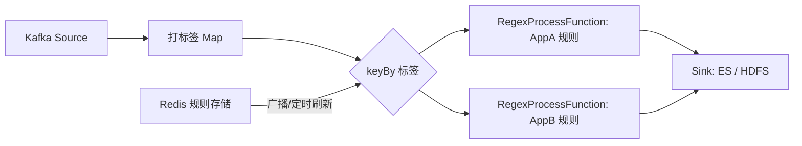

# Flink 背压机制与日志解析实践

## 场景背景

在实际的日志处理场景中，我们从 Kafka 获取不同应用的日志，并通过 **Drools 规则引擎**来解析日志字段。随着业务量增长，出现了以下问题：

1. **背压严重**：Drools 引擎属于高耗时逻辑，当日志量增大时，数据堆积在引擎阶段，最终导致任务背压传播失败。
2. **数据堆积**：Kafka 分区消息在 Flink 任务内部无法被及时消费，造成堆积。
3. **内存溢出**：Drools 的状态管理与日志缓存过多，最终导致生产环境 OOM。

---

<!-- more -->

## 背压机制简析

- Flink 背压的核心思想：

  - **背压产生**：当下游算子处理能力不足时，Flink 会通过 TCP 反压机制把压力层层向上游反馈。
  - **传播链路**：上游 Source → 中间算子 → Sink 逐级传递，形成“水位”。
  - **失效场景**：如果所有逻辑绑定在同一个算子链中（如 map→map→sink），背压无法被合理分段传播，上游无法感知瓶颈。

  Drools 解析阶段由于耗时过长，**成为瓶颈算子**，导致 Flink 的背压机制无法有效工作，进而出现了数据堆积与 OOM。

---

## 问题分析

1. **Drools 高耗时**
   - 每条日志需要转换为 Fact，再触发规则引擎推理。
   - 引擎构建复杂，占用大量内存。
2. **规则更新复杂**
   - Drools 规则变更需要重新编译。
3. **算子链合并问题**
   - 如果所有操作在同一链路，背压无法有效隔离。

---

## 临时解决方案

临时的应对措施是：

- **区分不同应用日志的 Topic**：
  - `appA-logs`
  - `appB-logs`
- **为每个 Topic 启动独立 Flink 任务**，而不是单个 Job：
  - `AppAJob`
  - `AppBJob`

这样：

- 各业务系统互相隔离。
- 单个 Topic 的流量压力减轻。
- 避免因某一个规则引擎瓶颈拖垮整个集群。

虽然短期内缓解了问题，但 Drools 的内存消耗和规则更新开销依然存在。

---

## Drools 与动态正则方案对比

为什么换成动态正则能带来性能和内存的优化？关键区别如下：

| 对比项       | Drools 方案                                                  | 动态正则方案                                              |
| ------------ | ------------------------------------------------------------ | --------------------------------------------------------- |
| **规则存储** | 规则需要编译成完整的 Rete 网络结构，内存常驻复杂对象         | 每条规则就是一个字符串（正则），仅需存储少量 Pattern 对象 |
| **规则更新** | 规则直接存储在 Redis，Flink 广播/定时同步，同步后还需要重新构建 | 规则直接存储在 Redis，Flink 广播/定时同步即可             |
| **规则执行** | 每条日志需先转化为 Fact，再触发引擎匹配，涉及推理网络        | 直接调用 Pattern.matcher() 进行字符串匹配                 |
| **内存消耗** | 维护 Rete 网络 + Working Memory，随规则数、fact 数量增长     | 每个算子只保存自己负责的规则子集，内存占用极小            |
| **适用场景** | 复杂的事实推理、跨事件规则                                   | 日志解析、字段提取、模式匹配等流式场景                    |

因此，即便 Drools 也能与 Flink 的算子机制（如 keyBy）配合，
它依然会为每个并行子任务实例化完整的规则引擎对象，
导致 **高内存占用和计算开销**。
而动态正则方案则通过 **轻量规则 + 广播 + keyBy 分流** 的方式，
实现了 **规则管理简单、内存消耗低、执行效率高**。

---

## 最终解决方案

最终方案采用 **动态正则规则替代 Drools**，核心思路：

1. **规则管理**

   - 规则存储在 Redis，格式如：

     ```json
     {
       "appA": {
         "level_rule": "(?<timestamp>\\d{4}-\\d{2}-\\d{2}) (?<level>INFO|ERROR) (?<class>\\S+) - (?<message>.*)"
       },
       "appB": {
         "http_rule": "(?<ip>\\d+\\.\\d+\\.\\d+\\.\\d+) - (?<user>\\S+)"
       }
     }
     ```

2. **规则实时更新**

   - Flink 作业订阅 Redis Pub/Sub 消息。
   - 同时定期（如每 5 分钟）全量拉取，保证一致性。

3. **算子逻辑**

   - 先对日志打标签（如 `appA`, `appB`）。
   - 使用 `keyBy(tag)`，保证同一类日志路由到同一并行子任务。
   - 每个子任务只需持有与自己标签相关的正则，避免全量匹配。

```java
DataStream<String> kafkaStream = env.fromSource(kafkaSource);

kafkaStream
    .map(log -> {
        // 简单逻辑打标签，例如 topicName -> tag
        return Tuple2.of(tag, log);
    })
    .keyBy(t -> t.f0) // 根据标签分流
    .process(new RegexProcessFunction(broadcastRules))
    .addSink(sink);
```

4. **正则匹配算子**
   - 每条日志只匹配自己标签对应的规则集。
   - 使用命名分组提取字段。

```java
public class RegexProcessFunction
    extends KeyedBroadcastProcessFunction<String, Tuple2<String, String>, Rule, JSONObject> {

    private transient MapState<String, Pattern> rules;

    @Override
    public void processElement(
            Tuple2<String, String> value,
            ReadOnlyContext ctx,
            Collector<JSONObject> out) throws Exception {

        String tag = value.f0;
        String log = value.f1;
        Pattern pattern = rules.get(tag);

        if (pattern != null) {
            Matcher matcher = pattern.matcher(log);
            if (matcher.matches()) {
                JSONObject obj = new JSONObject();
                for (String name : RegexUtils.getNamedGroups(pattern.pattern())) {
                    obj.put(name, matcher.group(name));
                }
                out.collect(obj);
            }
        }
    }
}
```

---

## RegexUtils 测试代码

```java
public class RegexUtils  {
    public static void main(String[] args) {
        String regex = "(?<timestamp>\\d{4}-\\d{2}-\\d{2}) (?<level>INFO|ERROR) (?<class>\\S+) - (?<message>.*)";
        String log = "2025-08-23 INFO com.example.Main - system started";
        Map<String, String> fields = extractNamedGroups(regex, log);
        System.out.println(JSON.toJSONString(fields));
    }

    public static List<String> getNamedGroups(String regex) {
        List<String> groupNames = new ArrayList<>();
        Pattern groupPattern = Pattern.compile("\(\?<([a-zA-Z][a-zA-Z0-9_]*)>");
        Matcher matcher = groupPattern.matcher(regex);
        while (matcher.find()) {
            groupNames.add(matcher.group(1));
        }
        return groupNames;
    }

    public static Map<String, String> extractNamedGroups(String regex, String input) {
        Pattern pattern = Pattern.compile(regex);
        Matcher matcher = pattern.matcher(input);
        Map<String, String> result = new HashMap<>();

        if (matcher.matches()) {
            List<String> groupNames = getNamedGroups(regex);
            for (String name : groupNames) {
                result.put(name, matcher.group(name));
            }
        }
        return result;
    }
}
```

输出：

```json
{
  "timestamp": "2025-08-23",
  "level": "INFO",
  "class": "com.example.Main",
  "message": "system started"
}
```

---

## Mermaid 数据流图



---

## 总结

1. **Drools 带来的问题**
   - 规则引擎复杂，内存占用高。
   - 规则更新不灵活。

2. **临时方案**
   - 不同业务拆分不同 Flink Job。
   - 降低单任务流量压力。

3. **最终方案**
   - Drools 替换为动态正则解析规则。
   - 规则存储于 Redis，支持实时更新。
   - 通过标签 + keyBy，实现规则与日志流的精准路由。
   - 使用命名分组提取日志字段。

该方案既保证了 **实时性**，又大幅度降低了 **内存和计算开销**