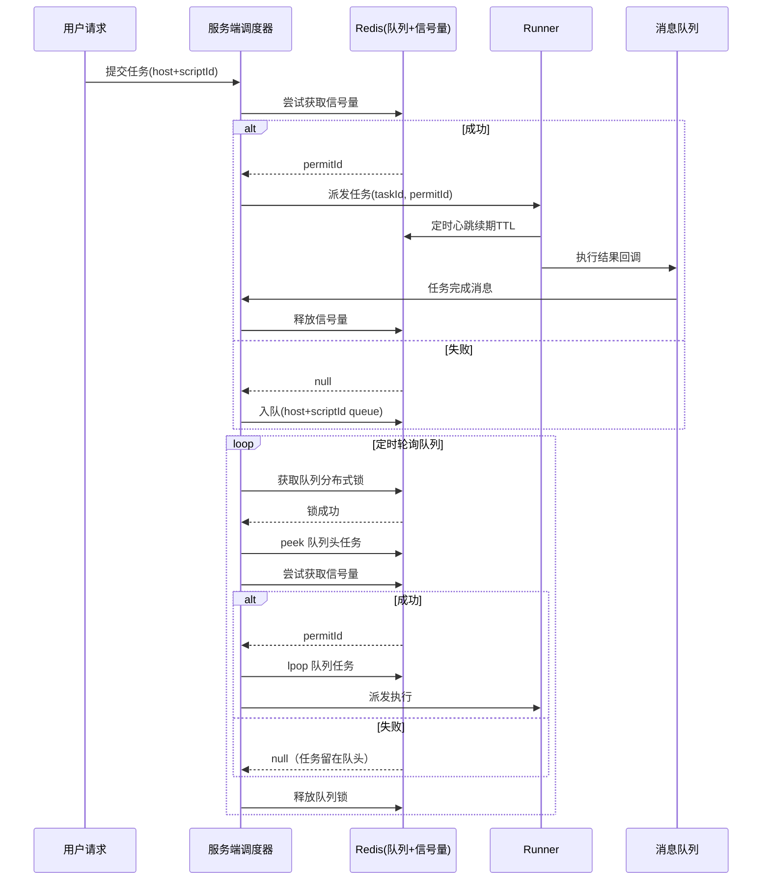

# 从分布式锁到信号量：基于 Redis 的轻量级任务调度与排队架构设计

## 背景

**背景**：在自动化运维平台中，大量脚本需要分发到不同主机执行，且需要保证任务公平性和执行隔离。

在分布式系统中，任务调度与执行往往面临以下几个挑战：

1. **公平性**：同一主机 + 脚本 ID 的任务必须严格顺序执行，避免用户看到“后提交的任务比先提交的先完成”的不合理现象。
2. **资源隔离**：部分任务耗时长、资源消耗大，需要严格控制并发数，避免系统被拖垮。
3. **高可用性**：调度系统本身需要支持多实例部署，避免单点。
4. **稳定性**：任务执行过程中可能 Runner 宕机，需要保障信号量能够自动释放，避免锁死。
5. **适度设计**：业务量级可控（最多 50 个排队任务），不适合引入过重的分布式调度框架。

------

<!-- more -->

## 原始链路设计

最原始的链路很简单：

- 用户请求 → 服务端 → Runner 执行。

问题：

- 没有任何并发控制，多个耗时长的任务可能同时挤到某台主机上，打爆资源。
- 顺序执行无法保证，可能后提交的任务先执行完。
- 多实例情况下任务可能被重复调度。

------

## 分布式锁方案的引入

为了解决**同一主机任务的互斥执行**，最直接的方式是 **分布式锁**：

- 每个 `(host+scriptId)` 对应一把 Redis 锁。
- 任务执行前先 `tryLock`，执行完成后 `unlock`。

问题：

1. 分布式锁只能解决互斥问题，但无法表达 **允许并发 N 个** 的需求（例如 CPU 密集型任务只允许 2 个并发）。
2.  分布式锁更倾向于同一个线程的完整操作实现加锁和解锁动作，不太匹配脚本执行这种跨服务的场景

所以，**单纯的分布式锁并不匹配业务场景**。

------

## 信号量方案的演进

基于上述问题，我们引入 **Redis 信号量**（Semaphore）：

- 每个 `(host+scriptId)` 配置信号量（permits 数量可配置，例如默认 1）。
- 任务到来时先尝试获取信号量：
    - 获取成功 → 直接执行。
    - 获取失败 → 入队，等待后续调度。

### 为什么用信号量而不是纯锁？

- 信号量可以灵活控制并发度，既能做到 **完全串行**，也能做到 **有限并行**。
- 配合 TTL 和 Runner 心跳，可以避免“锁死”问题。

------

## 队列机制的引入

为了保证公平性，我们为每个 `(host+scriptId)` 建立一个 **Redis List 队列**：

1. **任务执行路径**
    - 先尝试获取信号量。
    - 成功 → 立即派发执行。
    - 失败 → 入队（FIFO 队列）。
2. **队列调度路径**
    - 多个服务实例定时轮询 Redis 队列，但在取队列前加分布式锁，避免并发冲突。
    - 从队列头 peek 出任务，尝试获取信号量：
        - 成功 → `LPOP` 出队，派发执行。
        - 失败 → 保持在队头，保证公平性。

这样实现了：

- **公平性**：FIFO 严格保证任务顺序。
- **多实例扩展**：多个调度服务可并行调度不同队列。
- **轻量化**：仅依赖现有组件Redis和MQ

------

## 技术选型说明

### 1. 为什么不用 MQ（Kafka/RabbitMQ/其他 MQ）做排队队列？

- 业务量级小（队列任务 < 50），没必要引入重量级 MQ。
- MQ 更适合高吞吐日志流场景，而这里需要 **FIFO + 精确调度**，Redis List 更直观。
- Redis 原子操作 + 分布式锁即可满足需求。

### 2. 为什么不用 XXL-Job / Quartz 这样的调度框架？

- XXL-Job 更适合 **固定周期任务调度**，而这里的任务是 **事件驱动 + 排队顺序执行**。
- 本场景只需 **轻量定时轮询**，Redis 就能解决。
- 引入 XXL-Job 等价于过度设计，增加维护成本。

### 3. 为什么选择 Redis？

- Redis 提供原生的 List、Semaphore、分布式锁，三者组合即可完整解决需求。
- 性能高、延迟低，适合低量级任务调度场景。
- 部署简单，成本低。

------

## 落地方案设计

### 核心流程

1. **用户请求链路**
    - 新任务 → 尝试获取信号量。
    - 成功 → 直接派发 Runner。
    - 失败 → 入队列（host+scriptId 队列）。
2. **Runner 执行链路**
    - Runner 执行过程中，每隔 N 秒刷新 Redis TTL（看门狗心跳）。
    - 执行完成 → 回调服务端 → MQ → 服务端释放信号量。
3. **队列调度链路**
    - 定时任务轮询队列，但在获取队列前对 `(host+scriptId)` 加分布式锁。
    - 从队列头 peek 任务，尝试获取信号量：
        - 成功 → `LPOP` 出队，派发 Runner。
        - 失败 → 保持在队头（公平性）。

------

## 时序图

------

## 总结

通过 **信号量 + 队列 + 分布式锁** 的组合方案，我们实现了：

- **公平性**：任务严格按队列顺序执行。
- **资源控制**：不同任务可配置并发度。
- **高可用**：多实例调度无冲突，Runner 崩溃也能自动恢复。
- **轻量化**：仅依赖 现有Redis和Actimemq，无需引入 Kafka / XXL-Job 等重型组件。

这种架构设计在保证稳定性的同时，避免了过度设计，非常适合任务量级有限的中小型调度场景。

##  FAQ

### 1. 分布式锁和信号量到底有什么区别？为什么选择信号量？

- **分布式锁**：保证某一时刻只有一个线程/进程持有锁，天然是 **互斥** 的。
    - 支持可重入（需要线程 ID 识别）。
    - 适合“一次只能一个”的场景。
- **信号量**：允许同时存在多个持有者，代表可以控制并发度。
    - 需要一个唯一的 permit ID 来标识。
    - 适合“允许有限并发”的场景。

> 在本方案中，**单纯互斥不足以表达业务需求**（某些任务可以允许并发 2 个，某些必须串行），所以选择了 **信号量 + 队列** 的组合。

------

### 2. 信号量和分布式锁在 Redis 中为什么都需要持有者 ID？

Redisson 的分布式锁和信号量都会涉及“唯一标识”的问题：

- 锁需要绑定 **线程 ID**（保证可重入）。
- 信号量需要生成 **permit ID**（保证释放时不会误释放）。

解决方案：

- 信号量的 permit ID 可以由服务端生成并传给 Runner，Runner 完成后放到mq消息中再释放。
- 这样保证了 **持有者与释放者一一对应**，不会出现误释放。

### 3.**任务饿死问题**

- 采用 FIFO 且只 peek，不会出现新任务插队，所以不会饿死。
- 唯一风险是 Runner 崩溃但未释放信号量，解决办法就是 TTL + 超时回收。

### 4.**心跳丢失问题**

- Runner 宕机或心跳线程异常，可能导致 permit 永久占用。
- 解决方法：
    - TTL 机制必须可靠，Runner 定时刷新。
    - 服务端需要兜底：定时任务检测长时间未完成的任务，强制释放。

### 5.**多实例调度冲突**

- 多个调度器同时轮询同一队列，可能造成重复消费。
- 解决方法：
    - 队列取任务前加分布式锁（host+scriptId 粒度），保证只有一个实例处理该队列。

### 6.**公平性问题**

- 如果失败后任务被放到队尾，会造成后提交任务“插队”。
- 解决方法：
    - 本方案中采用 **peek + 队头保留**，保证严格 FIFO 公平性。

------

### 4. 为什么不用 Kafka / RabbitMQ 替代 Redis 队列？

- **Kafka**：偏向高吞吐日志流，缺乏精确 FIFO 语义。
- **RabbitMQ**：适合一次性投递-消费场景，但很难做“任务 peek + 重试 + 公平性”。
- **Redis List**：支持原子操作（LPOP/LPUSH），天然 FIFO，能灵活实现“peek + 回退”，完全符合需求。

------

### 5. 为什么不用 XXL-Job 或 Quartz？

- XXL-Job/Quartz 更适合固定周期调度任务。
- 本场景是 **用户触发 + 排队调度**，核心是公平性与信号量控制，并不适合用通用调度框架。
- 引入会显得过度设计，增加运维成本。

------

### 6. 队列需要手动把任务“塞回去”吗？

不需要。

- 在调度时，可以通过 `LINDEX key 0` 实现查看队头，只有成功获取信号量再执行 `LPOP` 出队，确保原子性。。
- 获取失败时，任务自然留在队头，保证公平性，不存在“再入队”的额外操作。

### 7. 回调必须幂等，释放信号量需要带上任务 ID / permit ID 校验

- **为什么要幂等？**
  Runner 可能因为网络抖动、超时、重试等原因多次发送“任务完成”回调，如果释放信号量操作不幂等，就可能错误释放还在执行的任务，破坏并发控制。
- **如何保证幂等？**
    - 释放时带上 `permitId`，执行前校验：
        - 只有持有该 `permitId` 的任务才能释放。
        - 如果 permit 已经被释放过，操作无效但不报错。
    - 服务端回调逻辑必须**可重试**，即使 MQ 重复投递消息也不会破坏一致性。
- 在轻量级场景下（队列长度 <50），直接依赖 `permitId` 释放即可，Redisson 本身保证幂等，几乎不会出现重复释放问题。
- 如果要增强一致性，可以在释放前查数据库任务状态（`taskId`），避免任务状态和信号量状态脱节。
- 更严格的实现是 `(taskId + permitId)` 双校验，但这会带来额外复杂度，是否采用取决于业务规模和一致性要求。

### 8. 队列长度阈值预警方案

- **为什么要预警？**
    - 如果某个 `(host+scriptId)` 队列长度快速增加，说明资源不足或 Runner 出现问题，任务会持续堆积。
    - 必须要在运维层面提前发现，而不是等任务超时才报警。
- **如何实现？**
    - 在 Redis 层，周期性统计各个队列长度（`LLEN`）。
    - 配置阈值：例如单队列 > 20 条，或者全局任务 > 200 条，触发告警。
    - 告警内容：`(host+scriptId)` + 队列长度 + 最近等待时间。
- **优化扩展**：
  可以结合 **Prometheus Exporter** 暴露 Redis 队列长度指标，用 Grafana 监控和报警。